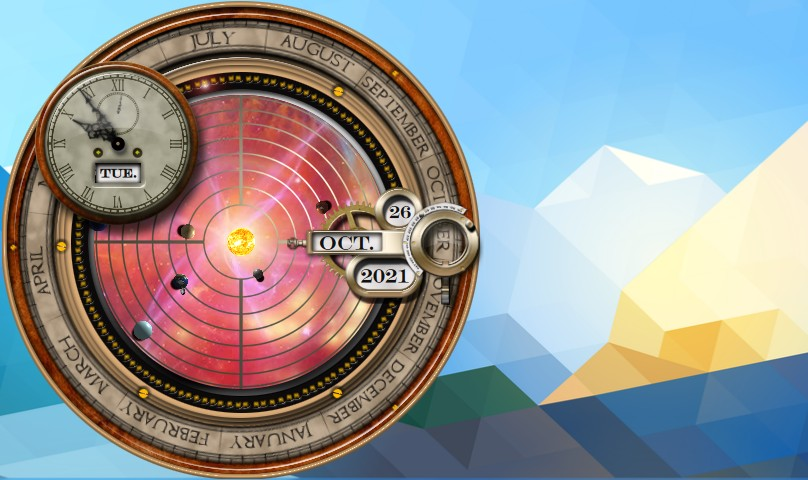

Time Keeper Evolution
===========
This plasmoid provides a clock and a calendar functions via steampunk interface.  
It is written entirely in QML + JavaScript and runs under Plasma 5.

This plasmoit is based on the work done by Joker [here](https://github.com/Joker/timekeeper) but it has been havely refactored to make the code easier to understand, and extended with many new features, like a fully functional orrery.  
Graphics in this plasmoid orginate from [Steampunk orrery](http://lightquick.co.uk/downloads/steampunk-orrery-xwidget.html)  
For the Moon, graphics from [Luna QML](http://kde-apps.org/content/show.php?content=140204) were used.  
[Video preview](http://vimeo.com/69154043)  

Create package
--------------
Run the following in the main directory of the project:

    make plasmoid

Installation
------------
Run the following in the main directory of the project:

    make install

